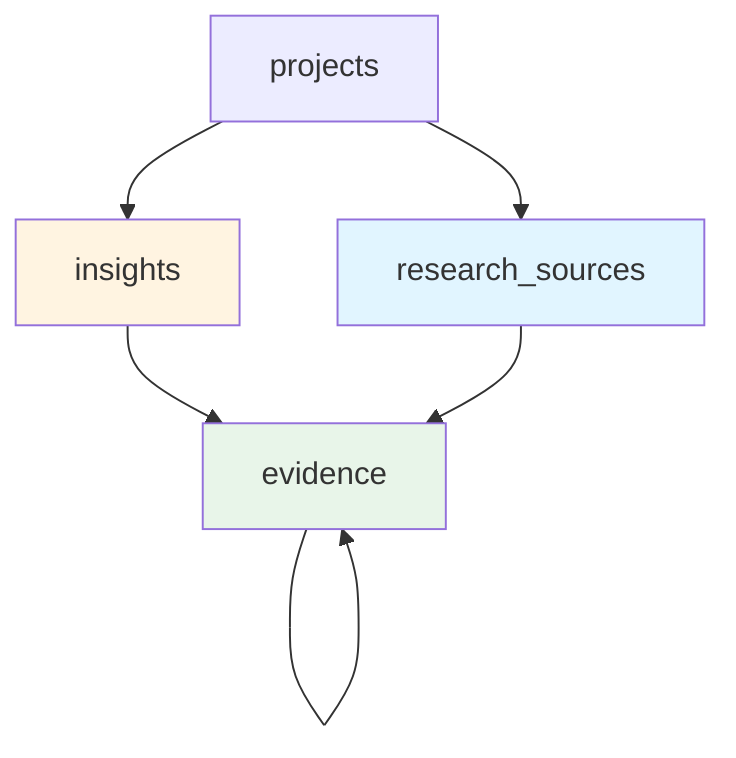

# LaunchLens Insight Engine Enhancement Plan

## Executive Summary

This plan enhances the Insight Engine to ensure insights come from **core customer demographics** (e.g., "boomers" for protein drinks research) and provides researchers with granular control over evidence validation and inclusion.

---

## Current State Analysis

### Existing Flow
1. User creates project with `title`, `target_audience`, `research_question`
2. Scrapers collect content from Reddit, TikTok, Web (no demographic filtering)
3. OpenAI extracts insights from top 40 scraped items
4. Insights displayed with quotes, but no evidence hierarchy or researcher controls

### Key Gaps
- **No demographic filtering**: System scrapes all content related to category, not filtered by target audience
- **Flat evidence structure**: Quotes are attached to insights, but no sub-evidence or hierarchical organization
- **No researcher controls**: Cannot mark evidence as fact/opinion, include/exclude, or validate claims
- **No media attachments**: Cannot attach screenshots or citations to evidence
- **Missing Instagram**: No Instagram scraper implemented

---

## Enhancement Architecture

### 1. Database Schema Changes

#### New Migration: `0003_demographic_filtering.sql`

```sql
-- Add demographic fields to research_sources
ALTER TABLE research_sources ADD COLUMN author_profile JSONB;
ALTER TABLE research_sources ADD COLUMN demographic_match_score REAL DEFAULT 0.0;
ALTER TABLE research_sources ADD COLUMN demographic_signals JSONB;

-- New table: evidence (replaces flat quotes structure)
CREATE TABLE evidence (
  id UUID PRIMARY KEY DEFAULT gen_random_uuid(),
  insight_id UUID NOT NULL REFERENCES insights(id) ON DELETE CASCADE,
  parent_evidence_id UUID REFERENCES evidence(id) ON DELETE CASCADE,
  text TEXT NOT NULL,
  source_id UUID REFERENCES research_sources(id) ON DELETE SET NULL,
  source_url TEXT,
  evidence_type TEXT CHECK (evidence_type IN ('quote', 'statistic', 'observation', 'screenshot')),
  
  -- Researcher controls
  validation_status TEXT DEFAULT 'pending' CHECK (validation_status IN ('pending', 'verified', 'disputed', 'excluded')),
  is_fact BOOLEAN,
  researcher_notes TEXT,
  
  -- Media attachments
  media_url TEXT,
  media_type TEXT,
  
  -- Demographic context
  demographic_match_score REAL DEFAULT 0.0,
  
  created_at TIMESTAMPTZ NOT NULL DEFAULT now(),
  updated_at TIMESTAMPTZ NOT NULL DEFAULT now()
);

CREATE INDEX evidence_insight_idx ON evidence(insight_id);
CREATE INDEX evidence_parent_idx ON evidence(parent_evidence_id);
CREATE INDEX evidence_validation_idx ON evidence(validation_status);

-- Add demographic filtering to insights
ALTER TABLE insights ADD COLUMN demographic_relevance_score REAL DEFAULT 0.0;
ALTER TABLE insights ADD COLUMN primary_demographic TEXT;

-- Migrate existing quotes to evidence table
INSERT INTO evidence (insight_id, text, source_url, evidence_type, validation_status)
SELECT insight_id, text, source_url, 'quote', 'verified'
FROM quotes;

-- RLS for evidence
ALTER TABLE evidence ENABLE ROW LEVEL SECURITY;

DROP POLICY IF EXISTS "evidence via insight project" ON evidence;
CREATE POLICY "evidence via insight project" ON evidence
  FOR ALL USING (
    EXISTS (
      SELECT 1 FROM insights i
      JOIN projects p ON p.id = i.project_id
      WHERE i.id = evidence.insight_id AND p.user_id = auth.uid()
    )
  ) WITH CHECK (
    EXISTS (
      SELECT 1 FROM insights i
      JOIN projects p ON p.id = i.project_id
      WHERE i.id = evidence.insight_id AND p.user_id = auth.uid()
    )
  );
```

#### Schema Diagram



---

## 2. Demographic Filtering System

### 2.1 Author Profile Extraction

Add demographic inference to each scraper:

#### Reddit Enhancement
```typescript
// src/lib/scrapers/reddit.ts
interface AuthorProfile {
  username: string;
  age_indicators?: string[];  // e.g., ["born in 1965", "retired"]
  location_indicators?: string[];
  occupation_indicators?: string[];
  self_description?: string;
}

async function extractAuthorProfile(username: string): Promise<AuthorProfile> {
  // Fetch user's profile and recent comments
  // Parse for demographic signals
}
```

#### Instagram Scraper (New)
```typescript
// src/lib/scrapers/instagram.ts
export async function scrapeInstagram(
  query: string,
  options: {
    hashtags?: string[];
    accounts?: string[];
    limit?: number;
  }
): Promise<ScrapedItem[]> {
  // Use Apify Instagram scraper or public API
  // Extract: posts, captions, comments, author bios
}
```

### 2.2 AI Demographic Matching

New prompt for demographic inference:

```typescript
// src/lib/prompts.ts
export const DEMOGRAPHIC_MATCHER_SYSTEM = `You analyze social media content to determine if the author matches a target demographic profile.

Output strict JSON with:
- match_score: 0.0 to 1.0 confidence
- signals: array of specific indicators found
- reasoning: brief explanation

Be conservative. Only high confidence (>0.7) when clear signals present.`;

export const DEMOGRAPHIC_MATCHER_USER = (args: {
  target_demographic: string;
  content: string;
  author_profile?: AuthorProfile;
}) => `Target demographic: ${args.target_demographic}

Content: ${args.content}

${args.author_profile ? `Author profile: ${JSON.stringify(args.author_profile)}` : ''}

Does this content come from someone in the target demographic?`;
```

### 2.3 Filtering Pipeline

```typescript
// src/lib/scrapers/demographic-filter.ts
export async function enrichWithDemographics(
  items: ScrapedItem[],
  targetDemographic: string
): Promise<ScrapedItem[]> {
  return Promise.all(
    items.map(async (item) => {
      // 1. Extract author profile (where available)
      const profile = await extractAuthorProfile(item);
      
      // 2. Run AI demographic matching
      const { match_score, signals } = await matchDemographic({
        target_demographic: targetDemographic,
        content: item.excerpt,
        author_profile: profile,
      });
      
      return {
        ...item,
        author_profile: profile,
        demographic_match_score: match_score,
        demographic_signals: signals,
      };
    })
  );
}
```

---

## 3. Enhanced Insight Extraction

### 3.1 Demographic-Aware Extraction

Update extraction prompt to consider demographic scores:

```typescript
// src/lib/prompts.ts - Enhanced
export const INSIGHT_EXTRACTOR_USER = (args: {
  title: string;
  audience: string;
  question: string;
  sources: Array<{
    kind: string;
    url?: string;
    title?: string;
    excerpt: string;
    demographic_match_score?: number;
    demographic_signals?: string[];
  }>;
}) => `Project: ${args.title}
Target audience: ${args.audience}
Research question: ${args.question}

Sources (${args.sources.length}):
${args.sources.map((s, i) => {
  const demo = s.demographic_match_score 
    ? `[Demographic match: ${Math.round(s.demographic_match_score * 100)}%${s.demographic_signals?.length ? ` - signals: ${s.demographic_signals.join(', ')}` : ''}]`
    : '';
  return `[${i + 1}] (${s.kind}${s.url ? ` — ${s.url}` : ''}) ${demo}
${s.title ? `TITLE: ${s.title}\n` : ''}${truncate(s.excerpt, 1800)}`;
}).join('\n\n---\n\n')}

IMPORTANT: Prioritize insights from sources with high demographic match scores (>70%). 
Flag insights with the primary demographic they represent.

Return JSON with enhanced shape:
{
  "insights": [
    {
      "type": "belief" | "goal" | "context" | "pattern",
      "title": "short noun phrase",
      "content": "2-4 sentences",
      "tension": "optional contradiction",
      "confidence": 0.0 to 1.0,
      "demographic_relevance_score": 0.0 to 1.0,
      "primary_demographic": "which demographic this insight represents",
      "evidence": [
        {
          "text": "verbatim quote",
          "source_index": 1,
          "evidence_type": "quote" | "statistic" | "observation",
          "demographic_match_score": 0.85
        }
      ]
    }
  ]
}`;
```

---

## 4. New Insight Card UI

### 4.1 Hierarchical Evidence Structure

```typescript
// src/components/EnhancedInsightCard.tsx
interface EvidenceItem {
  id: string;
  text: string;
  evidence_type: 'quote' | 'statistic' | 'observation' | 'screenshot';
  validation_status: 'pending' | 'verified' | 'disputed' | 'excluded';
  is_fact?: boolean;
  researcher_notes?: string;
  media_url?: string;
  demographic_match_score: number;
  children?: EvidenceItem[];  // Sub-evidence
}

export function EnhancedInsightCard({
  insight,
  evidence,
  onUpdateEvidence,
}: {
  insight: Insight;
  evidence: EvidenceItem[];
  onUpdateEvidence: (id: string, updates: Partial<EvidenceItem>) => void;
}) {
  return (
    <article className="panel p-5">
      {/* Header with demographic relevance */}
      <div className="flex items-center justify-between">
        <div className="flex items-center gap-2">
          <span className="dot" style={{ background: meta.color }} />
          <span className="text-xs uppercase">{insight.type}</span>
          {insight.demographic_relevance_score > 0.7 && (
            <span className="chip chip-success">
              Core customer: {Math.round(insight.demographic_relevance_score * 100)}%
            </span>
          )}
        </div>
        <div className="text-xs text-muted">
          Confidence: {Math.round(insight.confidence * 100)}%
        </div>
      </div>

      {/* Core belief */}
      <h3 className="mt-3 font-medium">{insight.title}</h3>
      <p className="mt-2 text-sm text-muted">{insight.content}</p>

      {/* Evidence tree */}
      <div className="mt-4 space-y-3">
        <div className="flex items-center justify-between">
          <h4 className="text-xs uppercase tracking-wide text-muted">
            Supporting Evidence
          </h4>
          <button className="btn-sm">Add Evidence</button>
        </div>

        {evidence.map((ev) => (
          <EvidenceNode
            key={ev.id}
            evidence={ev}
            onUpdate={(updates) => onUpdateEvidence(ev.id, updates)}
          />
        ))}
      </div>
    </article>
  );
}
```

### 4.2 Evidence Node Component

```typescript
function EvidenceNode({
  evidence,
  onUpdate,
  depth = 0,
}: {
  evidence: EvidenceItem;
  onUpdate: (updates: Partial<EvidenceItem>) => void;
  depth?: number;
}) {
  const [expanded, setExpanded] = useState(true);
  
  return (
    <div 
      className="border-l-2 pl-3"
      style={{ 
        marginLeft: `${depth * 1.5}rem`,
        borderColor: evidence.validation_status === 'verified' 
          ? 'var(--color-success)' 
          : evidence.validation_status === 'disputed'
          ? 'var(--color-warning)'
          : 'var(--color-border)'
      }}
    >
      {/* Evidence content */}
      <div className="flex items-start gap-2">
        <input
          type="checkbox"
          checked={evidence.validation_status !== 'excluded'}
          onChange={(e) => 
            onUpdate({ 
              validation_status: e.target.checked ? 'verified' : 'excluded' 
            })
          }
          className="mt-1"
        />
        
        <div className="flex-1">
          <div className="flex items-center gap-2 text-xs text-muted mb-1">
            <span className="chip chip-sm">{evidence.evidence_type}</span>
            {evidence.demographic_match_score > 0 && (
              <span className="chip chip-sm">
                Match: {Math.round(evidence.demographic_match_score * 100)}%
              </span>
            )}
          </div>
          
          <blockquote className="text-sm italic">
            "{evidence.text}"
          </blockquote>
          
          {evidence.media_url && (
            
          )}
          
          {/* Researcher controls */}
          <div className="mt-2 flex items-center gap-2">
            <button
              className={`btn-xs ${evidence.is_fact ? 'btn-primary' : ''}`}
              onClick={() => onUpdate({ is_fact: true })}
            >
              Fact
            </button>
            <button
              className={`btn-xs ${evidence.is_fact === false ? 'btn-primary' : ''}`}
              onClick={() => onUpdate({ is_fact: false })}
            >
              Opinion
            </button>
            <button
              className="btn-xs"
              onClick={() => onUpdate({ 
                validation_status: evidence.validation_status === 'verified' 
                  ? 'pending' 
                  : 'verified' 
              })}
            >
              {evidence.validation_status === 'verified' ? '✓ Verified' : 'Verify'}
            </button>
            <button className="btn-xs">Add Note</button>
            <button className="btn-xs">Add Sub-evidence</button>
          </div>
          
          {/* Researcher notes */}
          {evidence.researcher_notes && (
            <div className="mt-2 text-xs bg-yellow-50 p-2 rounded">
              Note: {evidence.researcher_notes}
            </div>
          )}
        </div>
      </div>
      
      {/* Child evidence (recursive) */}
      {evidence.children && evidence.children.length > 0 && (
        <div className="mt-2">
          {evidence.children.map((child) => (
            <EvidenceNode
              key={child.id}
              evidence={child}
              onUpdate={onUpdate}
              depth={depth + 1}
            />
          ))}
        </div>
      )}
    </div>
  );
}
```

---

## 5. Instagram Scraper Implementation

### 5.1 Apify Integration

```typescript
// src/lib/scrapers/instagram.ts
export async function scrapeInstagram(
  query: string,
  options: {
    hashtags?: string[];
    accounts?: string[];
    limit?: number;
  } = {}
): Promise<ScrapedItem[]> {
  const token = process.env.APIFY_TOKEN;
  if (!token) {
    console.warn('APIFY_TOKEN not set, skipping Instagram');
    return [];
  }

  const res = await fetch(
    `https://api.apify.com/v2/acts/apify~instagram-scraper/run-sync-get-dataset-items?token=${token}`,
    {
      method: 'POST',
      headers: { 'Content-Type': 'application/json' },
      body: JSON.stringify({
        directUrls: options.accounts?.map(a => `https://instagram.com/${a}`),
        hashtags: options.hashtags,
        resultsLimit: options.limit || 20,
        searchType: 'hashtag',
        searchLimit: 1,
      }),
      signal: AbortSignal.timeout(120_000),
    }
  );

  if (!res.ok) {
    throw new Error(`Instagram scraper failed: ${res.status}`);
  }

  const items = await res.json() as InstagramPost[];
  
  return items.map(post => ({
    kind: 'instagram' as const,
    url: post.url,
    title: `Instagram post by @${post.ownerUsername}`,
    excerpt: [
      post.caption,
      ...(post.comments?.slice(0, 5).map(c => c.text) || [])
    ].filter(Boolean).join('\n\n'),
    raw: {
      likes: post.likesCount,
      comments: post.commentsCount,
      author: post.ownerUsername,
      author_bio: post.ownerFullName,
      timestamp: post.timestamp,
    },
  }));
}

interface InstagramPost {
  url: string;
  caption?: string;
  ownerUsername: string;
  ownerFullName?: string;
  likesCount: number;
  commentsCount: number;
  timestamp: string;
  comments?: Array<{ text: string; ownerUsername: string }>;
}
```

### 5.2 Update Scraper Index

```typescript
// src/lib/scrapers/index.ts
import { scrapeInstagram } from './instagram';

const jobs: { name: string; run: () => Promise<ScrapedItem[]> }[] = [
  { name: 'reddit', run: () => scrapeReddit(primary, { limit: 10 }) },
  { name: 'web', run: () => scrapeWeb(primary, { limit: 4 }) },
  { name: 'tiktok', run: () => scrapeTikTok(primary, { limit: 10 }) },
  { 
    name: 'instagram', 
    run: () => scrapeInstagram(primary, { 
      hashtags: [plan.title.toLowerCase().replace(/\s+/g, '')],
      limit: 15 
    }) 
  },
];
```

---

## 6. API Endpoints

### 6.1 Update Evidence

```typescript
// src/app/api/projects/[id]/evidence/[evidenceId]/route.ts
export async function PATCH(
  req: Request,
  { params }: { params: Promise<{ id: string; evidenceId: string }> }
) {
  const { id, evidenceId } = await params;
  const body = await req.json();
  
  const supabase = await createClient();
  
  // Validate ownership via RLS
  const { data, error } = await supabase
    .from('evidence')
    .update({
      validation_status: body.validation_status,
      is_fact: body.is_fact,
      researcher_notes: body.researcher_notes,
    })
    .eq('id', evidenceId)
    .select()
    .single();
    
  if (error) {
    return NextResponse.json({ error: error.message }, { status: 400 });
  }
  
  return NextResponse.json(data);
}
```

### 6.2 Add Evidence

```typescript
// src/app/api/projects/[id]/evidence/route.ts
export async function POST(
  req: Request,
  { params }: { params: Promise<{ id: string }> }
) {
  const { id } = await params;
  const body = await req.json();
  
  const supabase = await createClient();
  
  const { data, error } = await supabase
    .from('evidence')
    .insert({
      insight_id: body.insight_id,
      parent_evidence_id: body.parent_evidence_id,
      text: body.text,
      evidence_type: body.evidence_type,
      media_url: body.media_url,
    })
    .select()
    .single();
    
  if (error) {
    return NextResponse.json({ error: error.message }, { status: 400 });
  }
  
  return NextResponse.json(data);
}
```

---

## 7. Implementation Phases

### Phase 1: Database & Core Infrastructure (Week 1)
- [ ] Create migration `0003_demographic_filtering.sql`
- [ ] Add `evidence` table with hierarchical support
- [ ] Migrate existing `quotes` to `evidence`
- [ ] Update TypeScript types in `src/lib/types.ts`

### Phase 2: Demographic Filtering (Week 2)
- [ ] Implement author profile extraction for Reddit
- [ ] Create demographic matching AI prompt
- [ ] Build `enrichWithDemographics()` pipeline
- [ ] Update research route to apply demographic filtering
- [ ] Add demographic scores to UI

### Phase 3: Instagram Scraper (Week 2-3)
- [ ] Implement Instagram scraper via Apify
- [ ] Add Instagram to scraper pipeline
- [ ] Test hashtag and account-based scraping
- [ ] Handle rate limits and errors gracefully

### Phase 4: Enhanced Insight UI (Week 3-4)
- [ ] Build `EnhancedInsightCard` component
- [ ] Implement `EvidenceNode` with researcher controls
- [ ] Add evidence validation workflow
- [ ] Support hierarchical sub-evidence
- [ ] Add media attachment support

### Phase 5: Evidence Management APIs (Week 4)
- [ ] Create PATCH `/api/projects/[id]/evidence/[evidenceId]`
- [ ] Create POST `/api/projects/[id]/evidence`
- [ ] Add file upload for screenshots
- [ ] Implement evidence deletion

### Phase 6: Testing & Refinement (Week 5)
- [ ] Test with real "boomers + protein drinks" scenario
- [ ] Validate demographic matching accuracy
- [ ] Refine AI prompts based on results
- [ ] Polish UI/UX for researcher workflow

---

## 8. Key Design Decisions

### Demographic Matching Strategy
- **Hybrid approach**: Combine profile parsing + AI inference
- **Conservative scoring**: Only high confidence (>0.7) marked as "core customer"
- **Show all, flag best**: Display all insights but clearly highlight demographic matches
- **Transparent signals**: Show what indicators led to demographic match

### Evidence Hierarchy
- **Tree structure**: Support unlimited nesting via `parent_evidence_id`
- **Flexible types**: Quote, statistic, observation, screenshot
- **Researcher-driven**: Manual validation and categorization
- **Non-destructive**: Never delete evidence, only mark as excluded

### Instagram Scraping
- **Apify-based**: Use proven scraper with residential proxies
- **Hashtag + account**: Support both discovery methods
- **Comment inclusion**: Scrape top comments for richer voice
- **Rate-aware**: Graceful degradation if limits hit

---

## 9. Success Metrics

### Demographic Accuracy
- **Target**: >80% of high-scored items (>0.7) verified as core customer by researcher
- **Measure**: Track researcher validation decisions

### Researcher Efficiency
- **Target**: 50% reduction in time to validate insights
- **Measure**: Time from research run to approved insights

### Evidence Quality
- **Target**: Average 3-5 pieces of evidence per insight
- **Measure**: Evidence count per insight, validation rate

### Source Diversity
- **Target**: Instagram contributes 20-30% of total evidence
- **Measure**: Evidence distribution across sources

---

## 10. Open Questions

1. **Screenshot storage**: Use Supabase Storage or external CDN?
2. **Demographic model**: Train custom model or rely on GPT-4?
3. **Real-time validation**: Should AI auto-validate evidence or always require researcher review?
4. **Export format**: How should hierarchical evidence appear in report exports?

---

## Next Steps

1. Review this plan with stakeholders
2. Prioritize phases based on business value
3. Set up development environment for Instagram scraper testing
4. Create detailed UI mockups for evidence management
5. Begin Phase 1 implementation